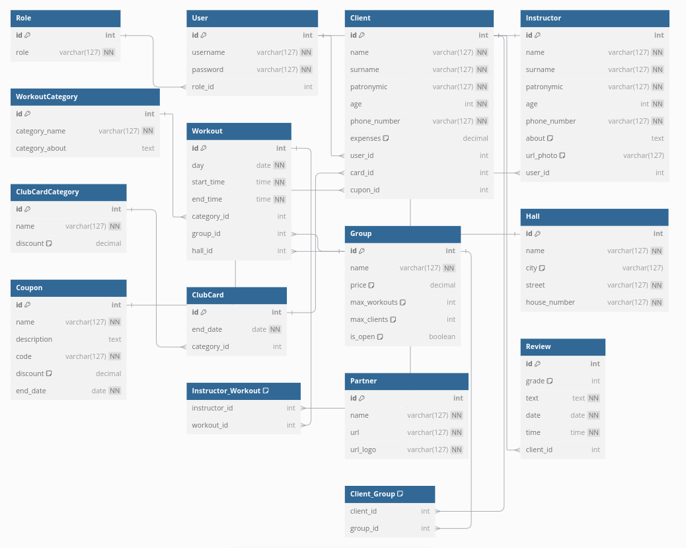

# BataDaseLabs
# Система управления фитнес-клубом

### Студент: Бекарев Станислав Сергеевич  
### Группа: 253505

## Тема проекта:
Разработка системы управления фитнес-клубом. Система предназначена для управления клиентами, инструкторами, тренировками, групповыми занятиями, а также клубными картами. В системе будет поддерживаться авторизация, управление пользователями, а также система ролей.

## Стек технологий
PostgreSQL + django + psycopg2 lib driver for python raw sql queries

## Функциональные требования:
### Обязательные функции:
1. **Авторизация и аутентификация пользователей**:
    - Пользователи (администраторы, клиенты, инструкторы) могут входить в систему через систему логина и пароля.
    - Разные роли пользователей: администратор, инструктор, клиент.
  
2. **Управление пользователями (CRUD)**:
    - Администратор может создавать, редактировать и удалять пользователей.
    - Каждый пользователь привязан к определённой роли
    - - Пользователи с ролью клиента или инструктора связаны с дополнительной информацией (профиль клиента или инструктора).

3. **Система ролей**:
    - Роли определяют доступ пользователей к функционалу системы:
      - **Администратор**: Управление пользователями, инструкторами, группами, тренировками, клубными картами.
      - **Инструктор**: Управление тренировками, создание групповых занятий.
      - **Клиент**: Запись на тренировки, просмотр своих занятий и клубных карт.

4. **Журналирование действий пользователя**:
    - Система должна фиксировать действия пользователей: авторизация, регистрация на тренировки, изменение данных профиля и др.

5. **Управление группами и тренировками**:
    - Инструкторы могут создавать тренировки и групповые занятия.
    - Клиенты могут записываться на групповые занятия и тренировки.
    - Система должна учитывать максимальное количество клиентов в группе и доступные тренировки для клиентов.

6. **Управление клубными картами**:
    - Администраторы могут управлять клубными картами, назначать их клиентам, задавать сроки действия и скидки.
    - Клубные карты дают клиентам скидки на тренировки и имеют срок действия.

## Описание таблиц базы данных:

### 1. Таблица `Role`:
   - **id** SERIAL PRIMARY KEY: Уникальный идентификатор роли.
   - **role** CHARACTER VARYING(31): Роль пользователя (администратор, клиент, инструктор).

### 2. Таблица `User`:
   - **id** SERIAL PRIMARY KEY: Уникальный идентификатор пользователя.
   - **username** CHARACTER VARYING(31) NOT NULL UNIQUE: Имя пользователя.
   - **password** CHARACTER VARYING(31) NOT NULL: Пароль.
   - **role_id** INTEGER NOT NULL REFERENCES Role (id): Роль пользователя (администратор, клиент, инструктор) (многие к одному).

### 3. Таблица `Client`:
   - **id** SERIAL PRIMARY KEY: Уникальный идентификатор клиента.
   - **name** CHARACTER VARYING(31) NOT NULL: Имя клиента.
   - **surname** CHARACTER VARYING(31) NOT NULL: Фамилия клиента.
   - **patronymic** CHARACTER VARYING(31) NOT NULL: Отчество клиента.
   - **age** INTEGER CHECK(age>18 AND age<120): Возраст клиента.
   - **phone_number** CHARACTER VARYING(31) NOT NULL: Номер телефона клиента.
   - **expenses** MONEY DEFAULT 0: Затраты клиента на тренировки.
   - **user_id** INTEGER UNIQUE NOT NULL REFERENCES User (id) ON DELETE CASCADE: Связь с таблицей пользователей (один к одному).
   - **card_id** INTEGER UNIQUE REFERENCES User (id) ON DELETE SET NULL: Связь с таблицей клубных карт (один к одному).
   - **cupon_id** INTEGER REFERENCES Cupon (id) ON DELETE SET NULL: Купон, предоставляющий скидку.
   
### 4. Таблица `Instructor`:
   - **id** SERIAL PRIMARY KEY: Уникальный идентификатор инструктора.
   - **name** CHARACTER VARYING(31) NOT NULL: Имя клиента.
   - **surname** CHARACTER VARYING(31) NOT NULL: Фамилия клиента.
   - **patronymic** CHARACTER VARYING(31) NOT NULL: Отчество клиента.
   - **age** INTEGER CHECK(age>18 AND age<120): Возраст инструктора.
   - **phone_number** CHARACTER VARYING(31) UNIQUE NOT NULL: Номер телефона инструктора.
   - **about** TEXT: Дополнительная информация об инструкторе.
   - **url_photo** TEXT: Фото инструктора.
   - **user_id** INTEGER REFERENCES User (id) ON DELETE CASCADE: Связь с таблицей пользователей (один к одному).
   - **workouts**: Связь с таблицей занятий (многие ко многим), осуществляется через промежуточную таблицу.

### 5. Таблица `WorkoutCategory`:
    - **id** SERIAL PRIMARY KEY: Уникальный идентификатор категории.
    - **category_name** CHARACTER VARYING(31) UNIQUE NOT NULL: Название категории.
    - **category_about** TEXT: Подробнее о категории.

### 6. Таблица `Workout`:
   - **id** SERIAL PRIMARY KEY: Уникальный идентификатор тренировки.
   - **day** CHARACTER VARYING(10) CHECK(day IN ('Monday', 'Tuesday', 'Wednesday', 'Thursday', 'Friday', 'Saturday', 'Sunday')): День проведения занятия.
   - **start_time** TIME NOT NULL: Время начала тренировки.
   - **end_time** TIME NOT NULL: Время окончания тренировки.
   - **category_id** INTEGER NULL REFERENCES WorkoutCategory (id) ON DELETE SET NULL: Категория тренировки (многие к одному).
   - **group_id** INTEGER NULL REFERENCES Group (id) ON DELETE SET NULL: Связь с таблицей групп (многие к одному).
   - **hall_id** INTEGER NULL REFERENCES Hall (id) ON DELETE SET NULL: Связь с таблицей залов (многие к одному).

### 7. Таблица `Group`:
   - **id** SERIAL PRIMARY KEY: Уникальный идентификатор группы.
   - **name** CHARACTER VARYING(31) NOT NULL: Название группы.
   - **price** MONEY DEFAULT 0: Цена вхождения в группу.
   - **max_workouts** INTEGER DEFAULT 3 CHECK(max_workouts > 2): Максимальное количество тренировок для группы.
   - **max_clients** INTEGER DEFAULT 3 CHECK(max_clients > 2): Максимальное количество клиентов в группе.
   - **is_open** BOOLEAN DEFAULT TRUE: Флаг для определения возможности вступить в группу.
   - **clients**: Связь с таблицей клиентов (многие ко многим), осуществляется через промежуточную таблицу.

### 8. Таблица `Hall`:
   - **id** SERIAL PRIMARY KEY: Уникальный идентификатор зала.
   - **name** CHARACTER VARYING(31) NOT NULL: Название зала.
   - **city** CHARACTER VARYING(31) NOT NULL: Название города.
   - **street** CHARACTER VARYING(31) NOT NULL: Название улицы.
   - **house_number** INTEGER NOT NULL CHECK(house_number > 0): Номер дома.

### 9. Таблица `ClubCardCategory`:
   - **id** SERIAL PRIMARY KEY: Уникальный идентификатор категории клубной карты.
   - **name** CHARACTER VARYING(31) UNIQUE NOT NULL: Название категории.
   - **discount**: INTEGER DEFAULT 0 CHECK(discount >= 0 AND discount <= 100) Скидка по карте в процентах.

### 10. Таблица `ClubCard`:
   - **id** SERIAL PRIMARY KEY: Уникальный идентификатор клубной карты.
   - **end_date** DATE NOT NULL: Дата окончания действия карты.
   - **category_id** INTEGER NOT NULL REFERENCES ClubCardCategory (id) ON DELETE CASCADE: Связь с таблицей категорий клубных карт (многие к одному)
   - **client_id** INTEGER NOT NULL REFERENCES Client (id) ON DELETE CASCADE: Связь с таблицей клиентов (один к одному).

### 11. Таблица `Partner`:
   - **id** SERIAL PRIMARY KEY: Уникальный идентификатор партнера.
   - **name** CHARACTER VARYING(31) NOT NULL: Название партнера.
   - **url** TEXT: Ссылка на сайт партнера.
   - **url_logo** TEXT: Логотип партнера.

### 12. Таблица `Review`:
   - **id** SERIAL PRIMARY KEY: Уникальный идентификатор отзыва.
   - **grade** INTEGER DEFAULT 5 CHECK(grade > 0 AND grade < 6): Оценка.
   - **text** TEXT NOT NULL: Текст отзыва пользователя.
   - **date** DATE NOT NULL: Дата, когда был оставлен отзыв.
   - **time** TIME NOT NULL: Время, в которое был отсавлен отзыв. 
   - **client_id** INTEGER REFERENCES Client (id) ON DELETE SET NULL: Клиент, оставивший отзыв (многие к одному).
   
### 13. Таблица `Coupon`:
   - **id** SERIAL PRIMARY KEY: Уникальный идентификатор купона.
   - **name** CHARACTER VARYING(31) NOT NULL: Название купона.
   - **description** TEXT: Описание купона.
   - **code** CHARACTER(5) UNIQUE NOT NULL: Уникальный код купона.
   - **discount** INTEGER DEFAULT 0 CHECK(discout >= 0 AND discout <= 100): Скидка, предоставляемая купоном.
   - **end_date** DATE NOT NULL: Дата, до которой работает купон.
   
## Схема базы данных:
На изображении ниже представлена схематическая модель базы данных с основными связями и типами полей.

